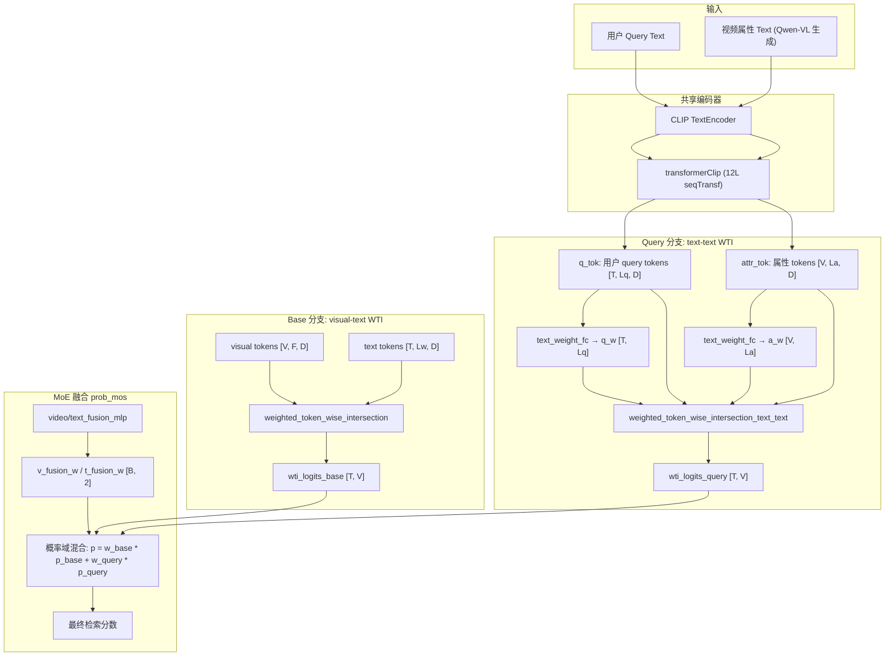

# Query 分支深度分析

> **历史快照，非当前科研路线**
>
> 本文记录 2026-03-02 的旧 Query 分支结构和 legacy 协议指标。
> 其中 49.1、37.8、10.2、30.4 等结果不能与 trusted-v1 基线直接比较；
> “改进方向”不构成当前实验优先级。当前决策只见
> [科研 Roadmap](../project/RESEARCH_ISSUES_AND_ROADMAP.md)，外部方法证据见
> [多模态检索研究综合分析](multimodal_retrieval_research_synthesis.md)。

> 日期：2026-03-02  
> 模型版本：ckpt_msrvtt_20260301_003358（enhanced_fusion + detach，default T2V R@1 = 49.1%）

## 1. 设计意图

Query 分支是 UATVR 的第二专家（Expert-2），与 Base 分支（视觉-文本匹配）互补。
其核心思想是：利用 Qwen-VL 为每个视频离线生成的属性描述，将检索问题转化为
**文本-文本语义匹配**，从而捕获 Base 分支（视觉 token 级匹配）遗漏的高层语义信号。

两个专家的输出通过不确定性引导的 MoE 融合，最终产出检索分数。

---

## 2. 架构与数据流

### 2.1 整体流程



### 2.2 关键组件

| 组件 | 位置 | 作用 |
|------|------|------|
| `weighted_token_wise_intersection_text_text` | `modeling_mulit.py:1357-1396` | query 分支核心：token 级交叉相似度 |
| `text_weight_fc` | `modeling_mulit.py` (共享) | token 重要性评分头，query/attr 两侧共用 |
| `video_fusion_mlp` / `text_fusion_mlp` | `modeling_mulit.py:346-355` | 从 `[logsigma, pooled_feat.detach()]` 预测融合权重 |
| `QueryFormer` | `query_models/module_query.py:34-76` | 语义模式下**未启用**（旧架构遗留） |
| `QuerySelectionHead` | `query_models/head.py:6-90` | 语义模式下**未启用** |

### 2.3 属性分块机制

每个视频的属性描述被分为 `attr_num_blocks=4` 个 block（每 block 最长 64 tokens）。
推理时对每个 block 独立计算 WTI，取 max-of-blocks 作为该 (query, video) 对的分数：

```python
# modeling_mulit.py:884-897
for bi in range(attrs_num_blocks):
    block_logits.append(
        self.weighted_token_wise_intersection_text_text(
            q_tok, q_mask, attr_tok_b[:, bi], attr_mask_b[:, bi]
        )
    )
wti_logits_query = torch.stack(block_logits, dim=0).max(dim=0).values
```

---

## 3. WTI text-text 匹配机制详解

`weighted_token_wise_intersection_text_text` 的计算分三步：

**Step 1: Token 重要性**

```
q_w = softmax(text_weight_fc(q_tok))   # [T, Lq]  每个 query token 的权重
a_w = softmax(text_weight_fc(a_tok))   # [V, La]  每个 attr token 的权重
```

**Step 2: Token 级交互矩阵**

```
logits_4d[t, v, l, m] = q_tok[t, l] · a_tok[v, m]   # [T, V, Lq, La]
```

**Step 3: Max-match + 加权聚合**

```
T2V 方向：对每个 query token，找最匹配的 attr token (max over La)，然后按 q_w 加权求和
V2T 方向：对每个 attr token，找最匹配的 query token (max over Lq)，然后按 a_w 加权求和
最终分数 = (T2V + V2T) / 2
```

这个 max-match 机制的特性：
- 只关注"最佳对齐"的 token 对，忽略整体分布
- 对共享词汇（停用词、高频描述词）产生的虚假高分缺乏区分力

---

## 4. T2V / V2T 不对称性分析

### 4.1 数据特征不对称

| 维度 | 用户 Query | 视频属性 (Qwen-VL) |
|------|-----------|-------------------|
| 长度 | 短（5-15 词） | 长（~200 词 / 4 blocks） |
| 风格 | 多样，口语化 | 统一模板，描述性 |
| 区分度 | 高（千差万别） | 低（大量共享词汇和模板句式） |
| 示例 | "a man cooking pasta" | "The video shows a person in a kitchen preparing food..." |

### 4.2 V2T 方向为何有效（R@1 = 30.4%）

```
V2T: 给定一个视频的属性 → 在 1000 个 query 中找匹配
```

- 属性描述内容丰富（场景、动作、物体、颜色），包含 query 中的关键词
- 1000 个 query 之间差异显著，max-match 能够锁定正确 query 中的关键词
- WTI 的 V2T 子分数（`max over Lq, weighted sum by a_w`）在此方向表现合理

### 4.3 T2V 方向为何崩溃（R@1 = 10.2%）

```
T2V: 给定一个 query → 在 1000 个视频的属性中找匹配
```

**根本原因：属性间区分度不足**

WTI 的 T2V 子分数计算：对 query 的每个 token 取与属性的 max cosine similarity。
当 1000 个视频的属性描述都包含 "a person", "the scene", "shows" 等高频词时：

```
query = "a man cooking pasta"

video_238 (正确): "The scene shows a person cooking pasta in a kitchen..."
video_512 (错误): "The scene shows a person performing on a stage..."
video_837 (错误): "The scene shows a person walking in a park..."
```

- token "a", "person", "the", "scene", "shows" → 在所有属性中都能找到高分 match
- 真正有区分力的 token 只有 "cooking" 和 "pasta"，但它们的 q_w 权重未必高
- max-match 被大量虚假高分淹没 → 正确视频和错误视频的分数差距极小

**对比 V2T 方向**：同样的数据，但反过来是"从详细属性出发，在差异大的 query 集合中找匹配"，query 间不存在上述高频模板问题。

### 4.4 数学视角

设 1000 个视频的属性 token 集合为 $A_1, A_2, \ldots, A_{1000}$。

T2V 分数 $s(q, A_v)$ 的分布：

$$s(q, A_v) = \sum_l q\_w_l \cdot \max_m (\mathbf{q}_l \cdot \mathbf{a}_{v,m})$$

当所有 $A_v$ 共享大量相似 token 时，$\max_m$ 操作对于大多数 query token $l$ 
都返回接近的值 → $s(q, A_v)$ 的方差极小 → ranking 接近随机。

---

## 5. 消融实验汇总

### 5.1 核心对比

| 模型 | 配置 | base T2V R@1 | query T2V R@1 | query V2T R@1 | default T2V R@1 | default V2T R@1 |
|------|------|:-:|:-:|:-:|:-:|:-:|
| 004450 | baseline（旧 query 架构） | 44.1 | 37.8 | 35.5 | 47.4 | 41.6 |
| 001549 | enhanced_fusion + attr_adapter | 43.4 | 14.7 | 30.1 | 48.9 | 43.0 |
| 021025 | enhanced_fusion（无 detach） | 43.7 | 13.7 | 30.1 | 48.5 | 43.0 |
| **003358** | **enhanced_fusion + detach** | 43.0 | 10.2 | 30.4 | **49.1** | **43.4** |

### 5.2 观察

1. **query T2V 随 enhanced_fusion 引入而崩溃**：37.8% → 10-14%，与 detach/attr_adapter 无关
2. **query V2T 保持稳定**：30-35%，方向性弱点证据确凿
3. **default 模式持续提升**：47.4% → 49.1%，MoE 有效利用 query 的 V2T 贡献
4. **MoE 学到的权重合理**：base ~71%, query ~29%，文本侧按内容自适应波动

### 5.3 旧 query 架构 vs 新语义架构

004450 使用旧的 QueryFormer 架构（从视频帧提取 query token → 与 text token 做 WTI），
query T2V 有 37.8%。该架构下 query 分支本质上是另一种视觉-文本匹配，
而非当前的文本-文本匹配，因此 T2V 不存在"属性同质化"问题。

---

## 6. 历史候选方向（已失效，不构成当前计划）

### 方向 A：改善属性的区分度

- **对属性做对比学习微调**：让同一视频的属性与其 query 拉近、与其他视频属性推远
- **生成差异化属性**：修改 Qwen-VL prompt，要求输出"与其他视频不同的独特细节"
- 代价：需要重新生成属性或增加后处理步骤

### 方向 B：改善 WTI 的区分机制

- **引入 IDF 加权**：对高频 token 降权，提升 rare token 的影响力
- **替换 max-match 为 soft-attention alignment**：避免 max 操作的信息损失
- 代价：修改 `weighted_token_wise_intersection_text_text` 函数

### 方向 C：混合架构

- **重新引入 QueryFormer**：将视觉信号注入 query 分支，使其回归 cross-modal matching
- **双路 query**：保留 text-text 路径（V2T 贡献），新增 visual-text 路径（T2V 恢复）
- 代价：增加模型参数和计算量

### 方向 D：接受现状，优化融合

- 当前 query 分支的 V2T 贡献已被 MoE 有效利用（default R@1 = 49.1%）
- 可专注优化 base 分支或融合策略，而非修复 query 的 T2V 弱点
- 最低风险路径

---

## 7. 文件索引

| 文件 | 说明 |
|------|------|
| `query_models/module_query.py` | QueryFormer 定义（当前语义模式下未使用） |
| `query_models/head.py` | QuerySelectionHead（当前语义模式下未使用） |
| `modules/modeling_mulit.py:874-901` | 语义 query 分支主逻辑 |
| `modules/modeling_mulit.py:1357-1396` | text-text WTI 函数 |
| `modules/modeling_mulit.py:1056-1065` | enhanced_fusion MLP 输入（含 detach） |
| `modules/modeling_mulit.py:1149-1180` | prob_mos 融合逻辑 |
| `modules/modeling_mulit.py:1266-1280` | query_sim_loss 计算 |
| `modules/modeling_mulit.py:1288-1309` | query_kd_loss（知识蒸馏） |
