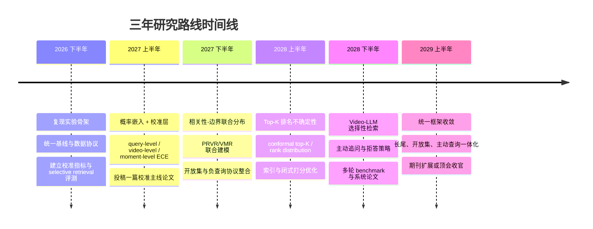
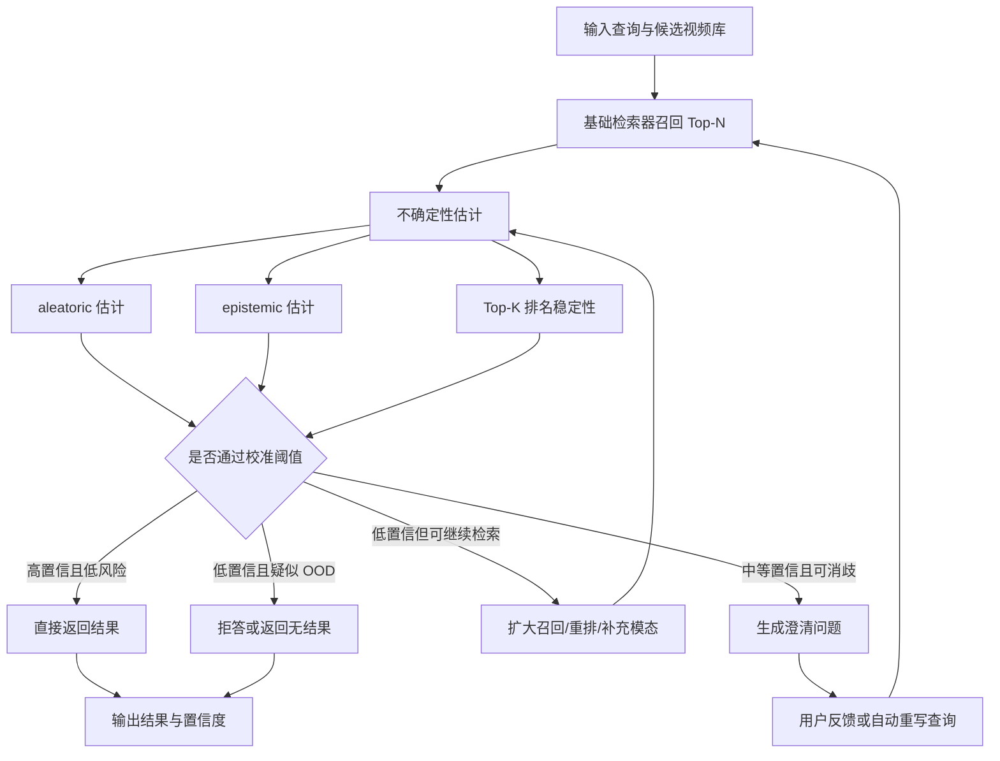

# 概率嵌入与不确定性学习在视频检索中的核心创新点分析报告

## 执行摘要

在视频检索中，“不确定性学习”已经从早期的**概率嵌入**逐步扩展到**证据学习、拒绝机制、开放集检索与交互式主动查询**。就最近三年的代表性工作看，研究重心经历了一个清晰迁移：先是把视频与文本从“单点表示”改成“分布表示”，以处理多义性、一对多对应与内容不对称；随后开始显式估计证据与置信度；再进一步把不确定性用于“是否应该返回结果、是否应该继续追问、是否应该拒绝回答”的决策。对应的代表工作包括 UATVR、T‑MASS、ProTA、UPRet、PAU、DUQ、RAL、Holmes、OpenVMR、UMIVR，以及面向 Video‑LLM 的 answerability / refusal 研究。citeturn0search4turn0search2turn1search4turn13search8turn0search9turn2search0turn1search2turn2search1turn11search3turn0search3turn10search0

但如果把目标从“提高 Recall@K / mAP / mIoU”切换到“让系统知道自己什么时候不可靠”，现有视频检索方法仍有明显空白。多数方法的“方差”“半径”“证据量”首先被当作**更好的表示学习工具**，而不是经过校准、可用于风险控制和拒绝决策的可靠置信度。与此同时，时刻检索领域已经开始显式研究负查询、开放集与相关性反馈，表明“无答案”“不相关查询”“需要继续提问”这些现实问题正在成为下一个研究主轴。citeturn0search2turn2search0turn1search2turn2search1turn21search0turn11search3turn9search2

基于你给出的潜力选题列表，并结合 2023–2026 年的代表性工作，本报告的核心判断是：**最值得优先投入的方向不是再做一版“更复杂的概率嵌入”，而是把不确定性从表示层推进到决策层**。具体而言，优先级最高的四条线是：**置信度校准与评价体系**、**联合建模视频相关性与时间边界**、**Video‑LLM 的选择性检索/主动追问/拒答**、以及**开放集与长尾查询校准**。而 **aleatoric / epistemic 分离**、**Top‑K 排名不确定性** 与 **避免大量采样的索引效率设计** 也很重要，但更适合做成上述主线的“方法学增强模块”，而不是单独成题。citeturn7search0turn7search1turn7search2turn7search3turn8search0turn14search0turn11search3turn21search0turn10search0turn0search3

如果目标是以 **单机 8–16 GPUs、三年周期、冲击顶会/期刊** 为约束，本报告建议形成一条主线与两条支线。主线是“**校准化的不确定性视频检索**”：把概率嵌入、证据学习、选择性预测与开放集检测连成一个统一框架；支线一是“**Top‑K 排名分布与 conformal 风险控制**”；支线二是“**面向 Video‑LLM 的主动查询与拒答决策**”。这三个方向既共享数据与评测，也能自然衔接成连续的论文序列。citeturn15search4turn14search0turn8search0turn7search3turn10search0turn0search3

## 问题定义与研究边界

本报告讨论的“视频检索”包含四类紧密相关但目标不同的任务。第一类是**文本—视频检索**，给定文本在候选视频库中找最相关视频；第二类是 **PRVR**，即部分相关视频检索，查询只对应长视频中的某个时刻，但训练时往往没有时刻级标注；第三类是**视频时刻检索/时间定位**，需要直接返回起止边界；第四类是**Video‑LLM 驱动的长视频检索/检索增强问答**，要求系统在检索、推理与回答之间动态决策。MSR‑VTT、DiDeMo、VATEX 常用于短视频文本检索；TVR、ActivityNet Captions、Charades‑STA、QVHighlights 则更常用于长视频或时刻检索场景。citeturn6search10turn6search8turn16search20turn16search7turn16search2turn16search20turn16search16

这里的“不确定性”至少有两层含义。**Aleatoric uncertainty** 指来自数据本身的不可约噪声，例如视频里有大量与查询无关的帧、文本描述过短、标注稀疏、视频质量低、字幕缺失等；**epistemic uncertainty** 指模型知识不足，即模型对该区域、该长尾语义或该分布外输入没有学明白，理论上可以通过更多数据或更好的模型减少。Kendall 与 Gal 对这一区分做了经典定义，而最近的视频检索工作大多只隐式刻画前者，或者把两者混在一个“方差”里。citeturn7search1turn7search9turn0search9turn2search1turn2search3

因此，本报告把“概率嵌入”和“真正可用的不确定性学习”刻意区分开来。前者的目标是用分布表示替代点表示，以更好处理一对多和多粒度语义；后者则要求满足更强条件：**不确定性必须与检索正确性、边界质量或拒绝决策显著相关，并能通过校准指标、风险—覆盖曲线或开放集评估被量化验证**。从这个意义上说，视频检索领域目前真正的缺口不是“有没有方差”，而是“这个方差能否支撑可靠决策”。citeturn15search2turn15search4turn7search0turn7search3turn8search0turn14search0

## 现有方法综述

**概率嵌入路线** 的核心创新，是把文本与视频映射为分布而非单点。PCME 在图文检索中已经证明，概率嵌入更适合表达多对多匹配；视频领域的 UATVR 进一步把文本—视频检索建模为分布匹配，并通过额外可学习 token 聚合多粒度语义；T‑MASS 则把文本扩展成带自适应半径的 stochastic embedding，以应对“短文本无法完整覆盖视频语义”的问题；ProTA 把概率建模细化到了 token 级，并显式处理内容不对称；UPRet、RAL 与 GraviAlign 分别在手语视频、PRVR 和高斯闭式匹配上继续推进。总体上，这条路线的主要贡献是**表达能力提升**与**一对多语义对应建模**，但其不确定性通常还没有和“校准良好的可靠性”严格绑定。citeturn15search2turn0search4turn0search2turn13search0turn13search8turn1search2turn12search17

**证据学习路线** 的目标更接近严格意义上的 uncertainty quantification。PAU 在跨模态检索中引入原型、Dempster–Shafer 理论与 Dirichlet 证据建模，用于量化 aleatoric uncertainty；Beyond Uncertainty 把 evidential deep learning 引入 Video Temporal Grounding；Holmes 则把 PRVR 中的相似度解释为多粒度证据，在 inter‑video 与 intra‑video 两层同时建模不确定性，并配合 query‑adaptive calibrated learning。相比普通高斯嵌入，证据学习的优势是**能输出“证据强弱”与“无知程度”**，更适合后续做拒绝或选择性预测。citeturn0search9turn2search3turn2search1turn7search2

**拒绝机制与开放集路线** 强调“有些查询本来就不该返回结果”。在时刻检索里，TSG‑RF 首次把“视频中可能不存在相关片段”纳入任务定义，并引入 relevance feedback；Moment of Untruth 把负查询显式纳入 NA‑VMR 评测，区分 in‑domain 与 out‑of‑domain negatives；OpenVMR 更进一步，提出 open‑set VMR，利用 normalizing flow 建模 ID query 分布，并通过不确定性分数搜索 ID/OOD 边界。这说明视频检索已经从“总要选一个答案”开始转向“先判断该不该答”。citeturn9search2turn21search0turn11search3

**交互式与主动查询路线** 则把不确定性直接用于系统决策。UMIVR 显式度量文本歧义、映射不确定性与帧质量不确定性，并基于这些量生成澄清问题；在更广义的 Video‑LLM 场景中，answerability 对齐工作表明，现有 Video‑LLM 往往不会自然地拒绝超出视频证据范围的问题，需要专门对齐；同时，Mr. BLIP、MomentSeeker 等工作又显示，MLLM/Video‑LLM 正在快速进入 moment retrieval 和长视频检索场景，这使“检索—追问—拒答”的统一决策链变得更现实。citeturn0search3turn10search0turn22search2turn22academia21

从方法谱系上看，当前视频检索中的核心创新可以浓缩成五个关键词：**分布化表示、证据化匹配、开放集拒绝、交互式消歧、以及从 top‑1 正确率走向风险控制**。后两者最有机会在未来三年构成新的方法突破。citeturn14search0turn8search0turn0search3turn11search3

## 核心论文对照表

| 论文 | 年份 | 方法类别 | 主要不确定性类型 | 关键技术 | 数据集 | 可复现代码链接/预印本链接 |
|---|---:|---|---|---|---|---|
| UATVR | 2023 | 概率嵌入 | 多粒度匹配歧义，偏 aleatoric | learnable aggregation tokens、distribution matching、prototype sampling | MSR‑VTT, VATEX, MSVD, DiDeMo | 代码：UATVR GitHub；预印本：arXiv:2301.06309 citeturn0search4turn4search0turn4search15 |
| PAU | 2023 | 证据学习 | aleatoric | prototype evidence、Dempster–Shafer、Dirichlet uncertainty | MSR‑VTT, MSVD, DiDeMo 等 | 预印本：arXiv:2309.17093 citeturn0search9turn1search16 |
| T‑MASS | 2024 | 概率嵌入 | 文本欠描述带来的语义不确定性 | stochastic text embedding、similarity‑aware radius、support text regularization | MSR‑VTT, LSMDC, DiDeMo, VATEX, Charades | 预印本：arXiv:2403.17998；代码仓库已标注存在 data leakage 风险 citeturn0search2turn4search11turn5search0 |
| ProTA | 2024 | 概率嵌入 | token 级部分相关与内容不对称 | dual partial‑related aggregation、token‑based probabilistic alignment、adaptive contrastive loss | MSR‑VTT, LSMDC, DiDeMo | 预印本：arXiv:2404.12216 citeturn1search0turn13search0 |
| UPRet | 2024 | 概率嵌入 | 手语视频语义稀疏与映射不确定性 | multivariate Gaussian、distribution matching、optimal transport | How2Sign 等 3 个手语检索基准 | 代码：UPRet GitHub；预印本：arXiv:2405.19689 citeturn13search8turn13search1turn13search5 |
| GMMFormer v2 | 2024 | PRVR 概率/弱监督 | clip 建模与 text‑clip 对应不确定性 | temporal consolidation、fine‑grained uniformity、optimal matching loss | TVR, ActivityNet Captions, TACoS | 代码：GMMFormer_v2 GitHub；预印本：arXiv:2405.13824 citeturn3search0 |
| Beyond Uncertainty | 2024 | 证据学习 | 边界回归不确定性，含 epistemic/aleatoric | evidential deep learning、deep evidential regression、Geom regularizer | Video Temporal Grounding benchmarks | 预印本：arXiv:2408.16272 citeturn2search3turn2search11 |
| ARL | 2025 | PRVR 消歧 | 语义歧义与潜在多正样本 | uncertainty + similarity 双准则识别 ambiguous pairs | PRVR benchmarks | 代码：ARL GitHub；预印本：arXiv:2506.07471；DOI: 10.1609/aaai.v39i3.32252 citeturn1search3turn5search2turn1search15turn1search11 |
| DUQ | 2025 | 概率嵌入/校准增强 | intra‑pair 与 inter‑pair 双重不确定性 | similarity uncertainty、distance uncertainty、diversity probability embedding | 主流 TVR benchmarks | 代码：DUQ GitHub；DOI: 10.24963/ijcai.2025/643 citeturn2search0turn5search1turn2search4 |
| RAL | 2025 | PRVR 概率嵌入 | query ambiguity + partial video relevance | Gaussian distributions、proxy matching、confidence gates | PRVR benchmarks | 预印本：arXiv:2509.01383 citeturn1search2turn1search14turn2search17 |
| UMIVR | 2025 | 交互式/主动查询 | 文本歧义、映射不确定性、帧质量不确定性 | TAS、MUS、TQFS、clarifying questions | MSR‑VTT, MSVD, DiDeMo, VATEX | 代码：umivr GitHub；预印本：arXiv:2507.15504 citeturn0search3turn4search3turn4search6 |
| Moment of Untruth | 2025 | 拒绝/负查询 | negative query uncertainty | Negative‑Aware VMR、ID/OOD negatives、negative rejection evaluation | QVHighlights, Charades‑STA | 代码与数据：MomentofUntruth GitHub；预印本：arXiv:2502.08544 citeturn21search0turn21search1 |
| Holmes | 2026 | 层次证据学习 | inter‑video / intra‑video 双层不确定性 | Dirichlet evidence、query‑adaptive calibrated learning、OT with dustbin | PRVR benchmarks | 代码：ICML26‑Holmes GitHub；预印本：arXiv:2605.06083 citeturn2search1turn13search2turn2search9 |
| OpenVMR | 2026 | 开放集/拒绝 | ID/OOD query uncertainty | normalizing flow、uncertainty boundary search、PU learning | Charades‑STA, ActivityNet Captions, TACoS 等 | 预印本：arXiv:2605.29812；MM 2024 DOI: 10.1145/3664647.3680947 citeturn11search3turn20search5turn11search1 |
| GraviAlign | 2026 | 概率嵌入 | 高斯语义质量与匹配可靠性 | Gaussian embedding、semantic attraction、geometric overlap、闭式匹配 | 主流 TVR benchmarks | CVPR 2026 Open Access 论文页 citeturn12search17turn18search3 |

从这张表可以看到，2023–2024 年的主流创新主要集中在“**如何让分布表示更好用**”，而 2025–2026 年开始明显转向“**如何让不确定性服务于校准、拒绝和交互决策**”。这也是本报告后续优先级判断的依据。citeturn0search4turn0search2turn2search1turn11search3turn0search3

## 潜力选题与优先级

下表先给出每个潜力选题的浓缩判断，随后再对每个选题展开为可直接写入论文提案的“可验证创新点”。

| 选题 | 创新点 | 可验证假设 | 推荐实验 | 优先级 |
|---|---|---|---|---|
| 分离 aleatoric / epistemic | 用异方差观测头建模数据噪声，用 evidential/ensemble 头建模模型无知，再在视频片段、查询 token、候选视频三个层面做分解 | 分离后，epistemic 与 OOD/长尾失败更相关，aleatoric 与边界模糊/文本欠描述更相关 | PRVR + VMR；加入视频退化、文本截断、标签稀疏三类可控噪声；评估 AUROC、ECE、AURC | 中 |
| 置信度校准与指标 | 给检索分数配校准层，并把 ECE、Brier、NLL、risk‑coverage 纳入主指标 | 同等 Recall 下，校准层可显著降低 ECE/AURC，且高置信度样本的真实正确率更接近预测值 | MSR‑VTT/DiDeMo + TVR/QVHighlights；对比温度缩放、Dirichlet 校准、conformal 校准 | 高 |
| Top‑K 排名不确定性 | 从“top‑1 是否稳定”扩展到“top‑K 集合是否可靠”，学习 query‑conditioned rank distribution 或 conformal top‑K set | 相比 top‑1 置信度，top‑K miss‑risk 更能预测真实用户体验与后续 RAG/LLM 成功率 | Conformal Ranked Retrieval + Over the Top‑1 思路迁移到视频检索；衡量 K‑coverage、set size、rank correlation | 中 |
| 联合建模相关性与时间边界 | 把“是否相关”和“边界在哪里”做成联合分布，而不是先检索再定位的两阶段松耦合 | 联合建模可在 PRVR/VMR 中同时提升视频级检索与边界质量，并降低 false localization | TVR, ActivityNet Captions, Charades‑STA, QVHighlights；比较 Moment‑DETR / QD‑DETR / PRVR baselines | 高 |
| Video‑LLM 选择性检索/主动追问/拒答 | 让模型在“直接答、先问、拒答、继续检索”四动作间基于不确定性策略决策 | 相比单轮检索或单纯拒答，主动追问能在低覆盖查询上提升成功率且控制交互轮数 | 基于 UMIVR + answerability + Mr.BLIP/MomentSeeker 构建多轮 benchmark | 高 |
| 开放集与长尾校准 | 同时建模 query OOD、语义长尾与 caption/query mismatch，统一处理 open‑set 和 realistic search queries | 开放集检测若与长尾校准联合学习，能减少“错误自信”而不仅是提高 AUROC | OpenVMR、NA‑VMR、Beyond Caption‑Based Queries 组合评测 | 高 |
| 索引效率与避免大量采样 | 把分布检索近似成闭式打分或双阶段 ANN：先按均值召回，再按不确定性重排；结合 HNSW/FAISS 压缩存储 | 以极小 Recall 损失换取显著更低延迟与显存/内存占用 | FAISS/HNSW、mean‑only ANN、uncertainty rerank；对比 1/4/8/16 次采样 | 中 |

**分离 aleatoric / epistemic**。这个方向的研究价值很高，但难点也最大，因为视频检索缺少现成的“ground‑truth uncertainty decomposition”。可验证的创新点可以这样设计。第一，构建**三路不确定性头**：query token 级 aleatoric、clip 级 aleatoric、candidate‑video 级 epistemic；新颖性在于现有视频检索方法通常只给一个统一方差，没有把查询、片段与候选视频三个层面拆开。第二，使用 **heteroscedastic + evidential** 的双头结构：前者负责输入噪声，后者负责模型无知；新颖性在于把 DER/EDL 的思想从连续边界回归扩展到检索匹配与候选排序。第三，引入**可控扰动实验**作为近似“真值”：视频模糊、帧缺失、字幕截断、查询泛化、训练集长尾裁剪分别对应不同不确定性来源；如果设计正确，aleatoric 应主要响应输入退化，epistemic 应主要响应分布外或少样本语义。第四，把这两类不确定性与错误类型绑定：**边界漂移、伪相关视频、长尾语义失败、负查询误命中** 应表现出不同归因图谱。这个方向的新颖点不在“再加一个方差头”，而在**首次把视频检索中的错误类型与 uncertainty decomposition 做可检验绑定**。它之所以只给“中”等优先级，是因为实验设计复杂、论文风险较高，但一旦做透，理论贡献会很强。citeturn7search1turn7search2turn2search3turn2search1turn11search3

**置信度校准与指标**。这是我认为最适合开题和起第一篇主论文的方向。可验证的创新点包括：其一，提出**retrieval calibration layer**，把概率嵌入或 evidential score 映射为“检索正确概率”；新颖性在于当前视频检索论文大多把不确定性当表示学习副产物，而非显式校准对象。其二，把 **ECE、Brier、NLL、AURC/risk‑coverage** 正式引入视频检索，分别在 video‑level、moment‑level 与 query‑level 上定义；新颖性在于现有 benchmark 仍以 Recall/mAP 为主，校准评测尚未成为主流协议。其三，引入**多粒度校准**：对“候选视频是否相关”“该视频中的 top‑1 moment 是否存在”“给定边界是否可信”分别校准，而不是只校准一个统一分数。其四，比较**post‑hoc calibration** 与 **train‑time calibration**，把温度缩放、Dirichlet/证据校准、density‑ratio calibration、conformal risk control 放到同一框架下；这里可以直接嫁接 probabilistic embedding miscalibration 与 conformal ranked retrieval 的思想。其五，设计**selective retrieval** 协议：系统可以拒绝返回低置信结果，以固定 coverage 比较剩余样本风险。新颖性不只是“指标换了”，而是把视频检索从**排序任务**升级为**风险控制任务**。这是高优先级，因为它最容易形成清晰贡献边界，也最容易和后续拒答、主动查询、开放集工作衔接。citeturn7search0turn7search3turn15search4turn8search0turn14search0

**Top‑K 排名不确定性**。该方向目前在视频检索里几乎还是空白。可验证的创新点包括：第一，从 Gomez 等人的 top‑1 retrieval uncertainty 扩展到**rank distribution over Top‑K**，即不再问“第 1 名稳不稳”，而是问“前 K 个候选集合是否足以覆盖真答案”；新颖性在于把用户真实使用场景中的“候选浏览”纳入 uncertainty 建模。第二，引入**set‑valued prediction** 或 **conformal Top‑K set**，让系统在误差率约束下动态决定该返回多少候选，而不是固定 K；这十分适合后续接 Video‑LLM/RAG。第三，定义**排名稳定性指标**，例如 query 下不同采样、dropout、ensemble 或数据增广结果的 Kendall/Spearman 稳定性，并将其与 miss‑risk 相关联。第四，把 **Top‑K set uncertainty** 与**后续定位/回答成功率**联动评估，证明它比单点置信度更贴近真实 pipeline。第五，针对 PRVR / VMR 加入**候选视频—候选时刻二层 Top‑K 风险**。这个方向给“中”等优先级，不是因为不重要，而是因为它更适合作为主线校准论文的第二篇增强版：理论新颖，但需要较强的评测设计和系统接口。citeturn14search0turn8search0turn7search3

**联合建模相关性与时间边界**。这是面向 PRVR / VMR 最有发表机会的方向之一。现有系统往往把“这个视频相关吗”和“相关片段在哪”拆成两阶段，导致高分视频内部仍可能没有真正可靠的边界；或者模型能找到边界，但视频级召回并不稳。可验证的创新点包括：其一，定义**joint relevance‑boundary distribution**，让视频相关性概率和边界后验分布共同存在；新颖性在于把 video‑level retrieval 与 moment‑level localization 从串联改为联合概率图。其二，在训练中引入**consistency regularization**：高视频级置信度必须伴随至少一个高质量片段，高边界不确定度则反向压低视频级置信度。其三，引入**evidential boundary head**，借鉴 Robust VTG 的 DER/SRAM，但把输出与整视频的拒绝/接受决策耦合。其四，对 PRVR 设计**weak‑moment latent variable**：把未知真实时刻作为潜变量，用 OT、EM 或 set prediction 近似；新颖性在于把 PRVR 的弱监督不确定性显式化。其五，统一评估“检索正确 + 边界可用”而不是只看其中之一。这个方向优先级高，因为它直接站在 PRVR/VMR 的任务痛点上，能比纯校准论文更靠近 CV/NLP 顶会的主流兴趣。citeturn1search2turn2search1turn2search3turn9search2turn19search1turn19search3

**Video‑LLM 的选择性检索、主动追问与拒答**。这条线最具前沿感，也最容易和 2025–2026 的 MLLM 浪潮对接。可验证的创新点包括：第一，构建一个四动作策略空间：**direct answer / retrieve more / ask clarification / abstain**，而不是把不确定性只映射成一个分数；新颖性在于把 uncertainty 变成 action policy。第二，把 UMIVR 的文本歧义、映射不确定性、帧质量不确定性扩展为**可训练的 decision policy**，而非 training‑free heuristics。第三，接入 Video‑LLM answerability 对齐，把“拒答是否正确”与“追问是否有增益”一起优化，而不是只优化问答准确率。第四，设计**uncertainty‑conditioned retrieval budget**：低不确定查询走一次检索，高不确定查询触发多轮追问或补检索。第五，为长视频场景加入**检索—摘要—追问闭环**，把 MomentSeeker / Mr.BLIP 这类 MLLM retriever 纳入统一比较。这个方向高优先级，但要注意工程复杂度高、benchmark 需要自建或重组。其最大新颖性是：把 Video‑LLM 从“会检索”推进到“知道何时该检索、何时该问、何时该拒绝”。citeturn0search3turn10search0turn22search2turn22academia21turn9search4

**开放集与长尾校准**。OpenVMR 与 NA‑VMR 已表明，视频检索需要面对根本不存在答案的查询；而 Beyond Caption‑Based Queries 则表明，真实搜索查询比训练 caption 更短、更泛、更欠描述。这两者结合起来，形成了一个更强的问题：**不是所有低置信案例都是 OOD，有些只是长尾且欠描述的 ID 查询**。可验证的创新点包括：其一，提出 **tri‑partition calibration**：把查询分成 ID‑easy、ID‑hard/long‑tail、OOD 三类，而不是只有 ID/OOD 两类。其二，构造**caption‑to‑search query shift** 基准，系统地测评 under‑specified、generalized 与 multi‑moment queries。其三，引入**class‑balanced / frequency‑aware uncertainty regularization**，抑制模型对 head concepts 的过度自信。其四，把开放集检测与选择性检索联合起来，比较“拒绝错误答案”与“继续发问”这两种不同保守策略。其五，在评测上同时报告 AUROC/AUPR、risk‑coverage 与 head / tail 分层 Recall。这个方向优先级高，因为数据分布偏移与长尾失真是现实系统必然遇到的问题，而且与 Video‑LLM、开放集拒绝和校准都能自然联动。citeturn11search3turn21search0turn11search10turn21search11

**索引效率与避免大量采样**。概率嵌入最大的工程痛点是：一旦需要 Monte Carlo 采样或复杂分布距离，检索延迟就会迅速上升。可验证的创新点包括：第一，采用**闭式分布相似度** 或 **moment‑matching approximation** 取代多次采样，直接对角高斯或低秩协方差打分；GraviAlign 的价值正在于此。第二，设计**mean‑first ANN + uncertainty‑aware rerank** 的双阶段索引：先用均值在 FAISS/HNSW 上召回，再用不确定性做轻量重排。第三，做**variance‑aware compression/quantization**：对高不确定向量使用更保守量化，对低不确定向量做更激进压缩。第四，引入**adaptive compute at inference**：只有分数接近决策边界的 query 才触发更多采样或更复杂打分。第五，把检索延迟、吞吐、显存/内存占用写进论文主结果，而不是只放附录。这个方向给“中”等优先级，是因为单独成题容易偏工程，但和主线结合后会非常有说服力。citeturn12search17turn17search0turn17search1turn17search12

## 关键实验设计与工程实现要点

如果以三年周期做一条成体系的研究线，实验设计最好形成“**共用骨架 + 任务特定头部**”的结构。建议骨架使用两个基础系：短视频文本检索用 CLIP4Clip / X‑Pool / UATVR / T‑MASS 作为代表性基线；长视频与时刻检索用 Moment‑DETR / QD‑DETR / GMMFormer / RAL / Holmes 作为代表性基线。这样做的好处是，你的所有创新都可以在“**点表示基线 → 概率嵌入基线 → 证据/校准增强模型**”这条明确演进线上比较。citeturn19search0turn19search14turn0search4turn0search2turn19search1turn19search3turn3search0turn1search2turn2search1

在**数据集**层面，建议分成三组。第一组是短视频文本检索：MSR‑VTT、MSVD、VATEX、DiDeMo，用来验证分布表示与校准是否影响标准 recall；第二组是长视频/PRVR/VMR：TVR、ActivityNet Captions、Charades‑STA、QVHighlights、TACoS，用来验证相关性—边界联合建模和负查询/开放集能力；第三组是 Video‑LLM 与拒答场景：UMIVR 使用过的 TVR benchmarks、UVQA/answerability 数据，以及用 NA‑VMR / OpenVMR / Beyond Caption‑Based Queries 改造出的多轮检索集。如此一来，几乎所有潜力选题都能落到已有 benchmark 上，不需要从零造数据。citeturn0search3turn16search20turn16search1turn16search7turn16search2turn21search0turn11search3turn10search0turn11search10

在**指标**层面，建议从第一篇开始就把评价分成三层。性能层报告 Recall@1/5/10、mAP、mIoU、R1@IoU=0.5/0.7 等传统指标；可靠性层报告 query‑level ECE、Brier、NLL、AURC/risk‑coverage、选择性准确率；开放集/拒绝层报告 AUROC、AUPR、FPR@95TPR、拒答准确率与 coverage。对 Top‑K 方向，再额外报告 K‑coverage、set size、Top‑K miss‑risk；对交互式方向，再报告平均交互轮数、单位轮次收益与用户成本约束下的成功率。这样写法的优势是，你的论文不会被审稿人质疑“只是换了指标”，因为你同时展示了**精度—可靠性—交互成本**三条曲线。citeturn7search0turn7search3turn8search0turn14search0turn11search3turn21search0

在**消融实验**上，建议有五类固定模块。第一类是表示层消融：点表示、对角高斯、低秩高斯、Dirichlet 证据。第二类是归因层消融：只建 aleatoric、只建 epistemic、二者联合。第三类是校准层消融：无校准、温度缩放、Dirichlet/密度比校准、conformal calibrated retrieval。第四类是决策层消融：只返回 top‑1、选择性返回、开放集拒绝、主动追问。第五类是计算层消融：采样次数 1/4/8/16、闭式打分、ANN 召回比例、rerank 深度。只要这五类消融稳定存在，你的文章系列就会形成连贯的实验逻辑。citeturn15search4turn7search0turn7search2turn8search0turn17search12

就**预期结果**而言，最稳妥的目标不是一开始就追求绝对 Recall 的大幅领先，而是追求三个更可信的模式。第一，在相近 Recall 下显著降低 ECE / AURC，这能够直接说明“不确定性有用”；第二，在开放集和负查询上显著提高 AUROC/AUPR，同时只带来极小的闭集性能损失；第三，在多轮交互设定下，以不超过 1–2 轮的平均追问获得明显更高的最终成功率。对于顶会审稿来说，这比单一地把 R@1 提升 0.5–1 个点更具说服力。citeturn7search0turn21search0turn11search3turn0search3turn10search0

在**可复现性与工程实现**方面，有几个现实建议非常重要。首先，不要默认所有“官方代码”都能直接作为干净基线：T‑MASS 的公开仓库目前明确标注“DO NOT USE IT”并指出 data leakage，这意味着该方法如果要纳入对比，必须通过论文复现而非直接沿用公开仓库。其次，优先选择已有官方实现的基线，如 UATVR、X‑Pool、CLIP4Clip、DUQ、UMIVR、Moment‑DETR、QD‑DETR、Holmes、ARL、UPRet；把没有稳定代码的模型放在次级补充对比中。再次，概率表示在工业或大规模学术配置中必须优先选择**对角协方差**、**低秩近似**或**闭式相似度**，否则批量检索与 re‑ranking 成本会过高。最后，真正上线 ANN 时，不要把完整分布直接塞进索引；更实际的方案是均值 ANN 召回加不确定性重排，这与 FAISS/HNSW 的成熟工程路径也更一致。citeturn5search0turn4search0turn19search6turn19search8turn5search1turn4search3turn19search5turn19search7turn2search9turn5search2turn13search1turn12search17turn17search12turn17search1

## 风险、缓解策略与三年研究路线

这条研究线的最大风险有四类。第一类是**“不确定性看起来合理，但和错误无关”**，也就是 variance/evidence 只是表征空间的副产品，不能预测失败；缓解策略是从第一篇开始就把 calibration、risk‑coverage 与 selective retrieval 做成主指标。第二类是**数据集过于理想化**，例如现有 query 大多是 caption‑style，而非真实搜索查询；缓解策略是引入 Beyond Caption‑Based Queries、NA‑VMR、OpenVMR 这类更现实协议。第三类是**Video‑LLM 方向容易被工程复杂度拖垮**；缓解策略是先做 retrieval‑only 的校准与开放集，再把决策层接到成熟 retriever 上。第四类是**采样与分布打分过慢**；缓解策略是尽早把 closed‑form scoring、双阶段 ANN 与 adaptive compute 纳入主干设计。citeturn7search0turn7search3turn11search10turn21search0turn11search3turn10search0turn17search12turn12search17

下面给出一条适合三年周期的路线图。它不是“按论文数量平均分配”，而是按**研究风险由低到高、资源投入由小到大**来推进：先做评价与校准，再做联合建模，再做交互与 Video‑LLM 决策层。

这条时间线背后的逻辑是：第一阶段优先拿到**可稳定复现且贡献边界清晰**的校准论文；第二阶段把不确定性和 video relevance / temporal boundaries 绑定，完成从“可靠打分”到“可靠定位”的跨越；第三阶段再做 Top‑K 与 Video‑LLM 的决策层，这样既能复用前面的 calibration infrastructure，也能自然形成“系列工作”的论文叙事。citeturn7search0turn2search3turn2search1turn8search0turn10search0turn0search3

最终的系统流程建议如下。关键不是“先估计不确定性”，而是**把它变成明确而可评测的动作选择**。

这个流程图所对应的方法学主张是：**不确定性估计本身不是终点，终点是风险受控的检索决策**。这与 SelectiveNet 的 reject option、conformal ranked retrieval 的风险控制、UMIVR 的主动追问、OpenVMR 的开放集拒绝，以及 Video‑LLM answerability 的拒答能力在精神上是一致的。citeturn7search3turn8search0turn0search3turn11search3turn10search0

综上，如果你的目标是形成一条既有理论深度、又有工程落点、还能连续发文的研究线，最推荐的主标题可以是：**“面向风险受控与选择性决策的校准化视频检索”**。第一篇聚焦校准与指标；第二篇聚焦相关性—边界联合不确定性；第三篇聚焦开放集、Top‑K 与 Video‑LLM 主动追问/拒答。这样的路线既覆盖你列出的高潜力选题，也最符合 2026 年之后视频检索从“更会匹配”走向“更会判断自己是否该匹配”的总体趋势。citeturn15search4turn2search1turn11search3turn0search3turn10search0