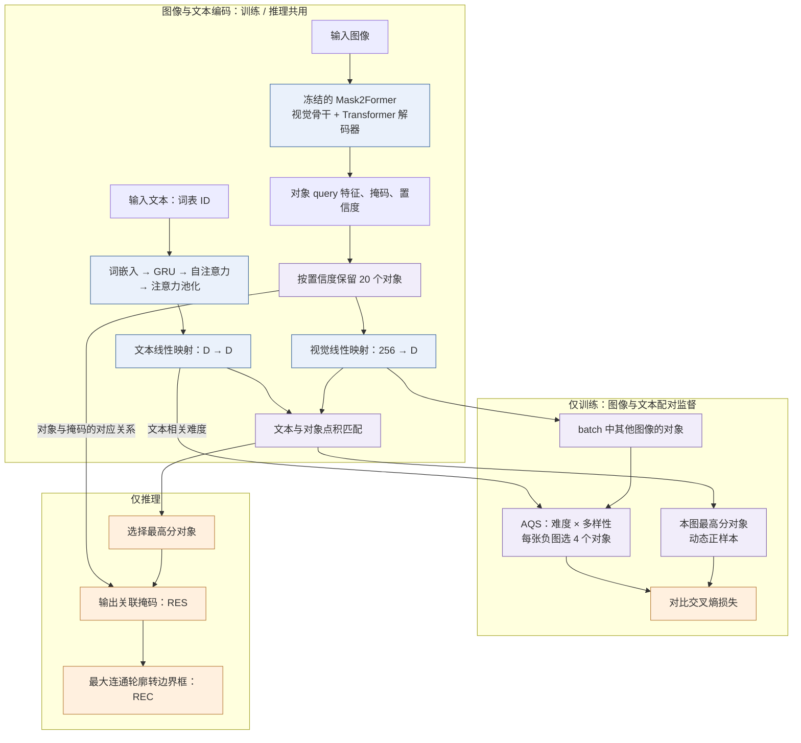

# QueryMatch 模块图

依据提交 83095e0。D 为 512 或 1024。训练更新文本编码器和映射层，视觉模型冻结。

```mermaid
flowchart TB
    subgraph common["图像与文本编码：训练 / 推理共用"]
        image["输入图像"] --> visual["冻结的 Mask2Former<br/>视觉骨干 + Transformer 解码器"]
        visual --> objects["对象 query 特征、掩码、置信度"]
        objects --> select["按置信度保留 20 个对象"]
        select --> vp["视觉线性映射：256 → D"]
        text["输入文本：词表 ID"] --> lang["词嵌入 → GRU → 自注意力<br/>→ 注意力池化"]
        lang --> tp["文本线性映射：D → D"]
        vp --> scores["文本与对象点积匹配"]
        tp --> scores
    end
    subgraph train["仅训练：图像与文本配对监督"]
        pos["本图最高分对象<br/>动态正样本"] --> loss["对比交叉熵损失"]
        neg["batch 中其他图像的对象"] --> aqs["AQS：难度 × 多样性<br/>每张负图选 4 个对象"]
        aqs --> loss
    end
    scores --> pos
    vp --> neg
    tp -->|文本相关难度| aqs
    subgraph inference["仅推理"]
        best["选择最高分对象"] --> mask["输出关联掩码：RES"]
        mask --> box["最大连通轮廓转边界框：REC"]
    end
    scores --> best
    select -->|对象与掩码的对应关系| mask
    classDef blue fill:#eaf1fb,stroke:#416a9e;
    classDef purple fill:#f1edfa,stroke:#8265ad;
    classDef orange fill:#fff0df,stroke:#bc8241;
    class visual,lang,vp,tp blue;
    class select,scores,aqs,pos,neg purple;
    class best,mask,box,loss orange;
```
