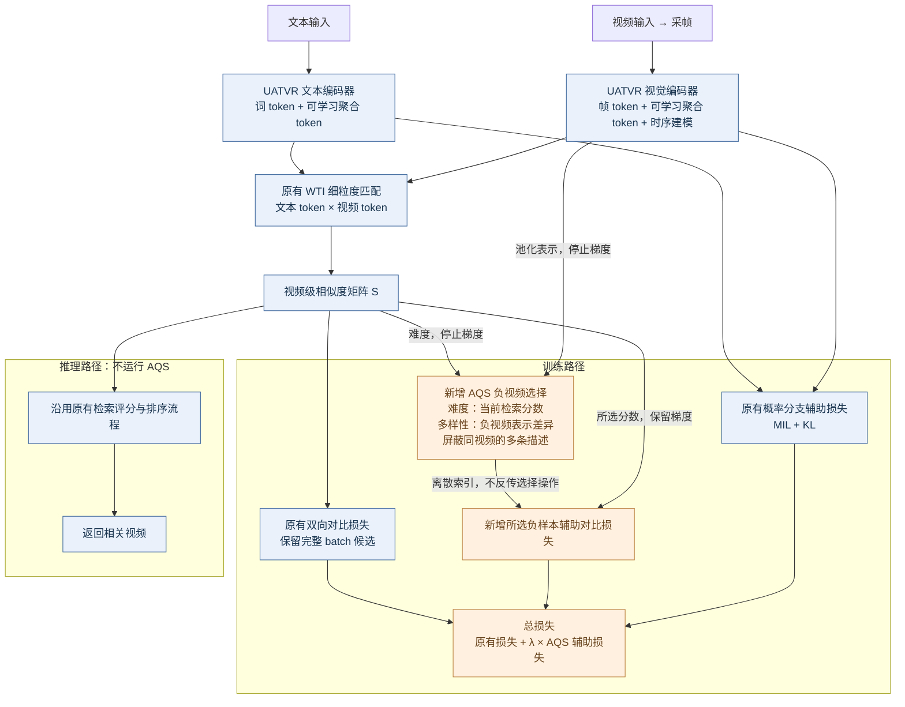

# UATVR + AQS 概念架构

设计草案，尚未实现或验证。保留现有 WTI 与概率辅助训练路径，新增视频级 AQS 选择及辅助对比损失。选择使用停止梯度的分数和表示；所选损失使用原始有梯度分数。推理计算结构不变，训练后的权重和排序结果可改变。

```mermaid
flowchart TB
    text["文本输入"] --> te["UATVR 文本编码器<br/>词 token + 可学习聚合 token"]
    video["视频输入 → 采帧"] --> ve["UATVR 视觉编码器<br/>帧 token + 可学习聚合 token + 时序建模"]
    te --> wti["原有 WTI 细粒度匹配<br/>文本 token × 视频 token"]
    ve --> wti
    wti --> scores["视频级相似度矩阵 S"]
    subgraph train["训练路径"]
        base["原有双向对比损失<br/>保留完整 batch 候选"]
        aqs["新增 AQS 负视频选择<br/>难度：当前检索分数<br/>多样性：负视频表示差异<br/>屏蔽同视频的多条描述"]
        extra["新增所选负样本辅助对比损失"]
        aux["原有概率分支辅助损失<br/>MIL + KL"]
        total["总损失<br/>原有损失 + λ × AQS 辅助损失"]
        aqs -->|离散索引，不反传选择操作| extra
        base --> total
        extra --> total
        aux --> total
    end
    scores --> base
    scores -->|难度，停止梯度| aqs
    ve -->|池化表示，停止梯度| aqs
    scores -->|所选分数，保留梯度| extra
    te --> aux
    ve --> aux
    subgraph inference["推理路径：不运行 AQS"]
        rank["沿用原有检索评分与排序流程"] --> result["返回相关视频"]
    end
    scores --> rank
    classDef existing fill:#eaf1fb,stroke:#416a9e,color:#19344f;
    classDef added fill:#fff0df,stroke:#bc8241,color:#67421c;
    class te,ve,wti,scores,base,aux,rank,result existing;
    class aqs,extra,total added;
```
